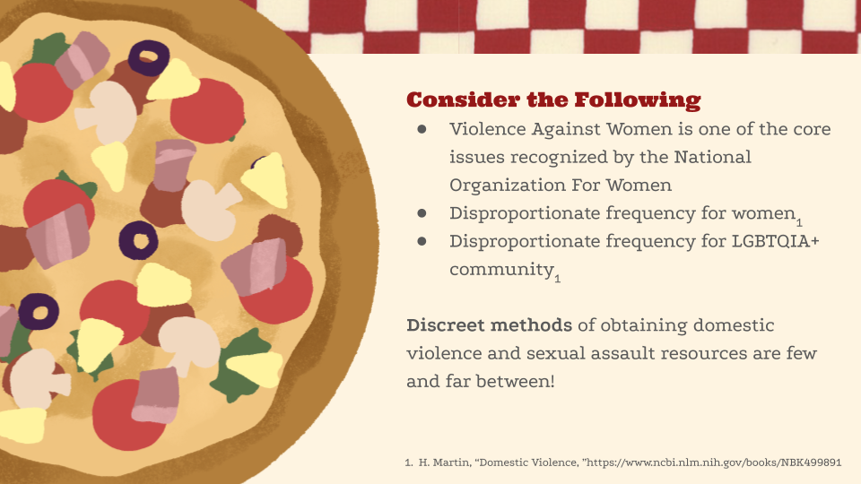
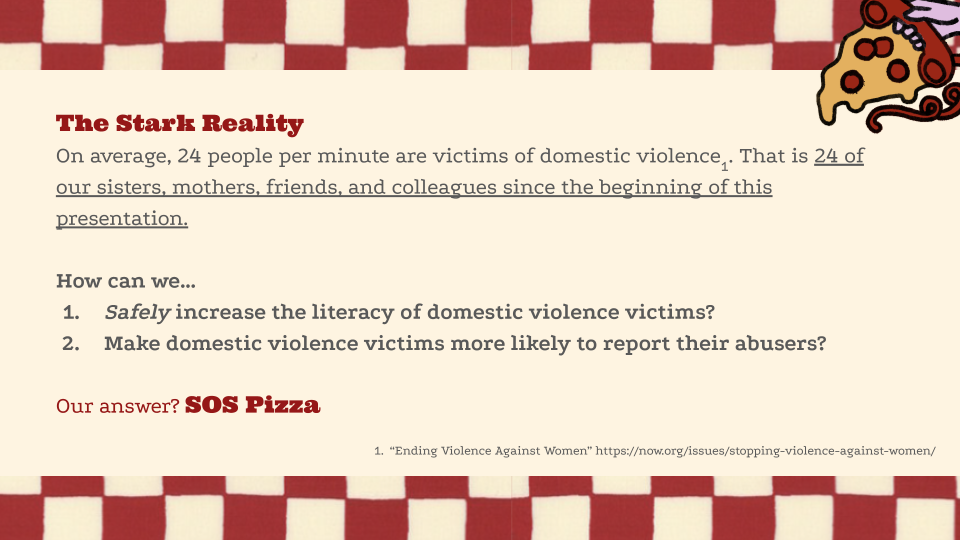

# SOS Pizza

SOS Pizza is a safety-focused website created during **RoseHack '26**, a women-centered hackathon hosted by Women in Compuing (WINC) at the University of California, Riverside (UCR).

The project explores how technology can help victims of domestic violence and sexual assault discreetly access resources and support. The platform presents safety resources through an interface that appears ordinary and non-threatening, allowing users to seek help without raising suspicion.

---

## RoseHack '26

This project was developed as part of **RoseHack '26**, a hackathon centered on empowering women and addressing issues that disproportionately affect women and marginalized communities.
RoseHack is hosted by the **University of California, Riverside** and encourages teams to develop socially impactful technological solutions.

---

## Observation

Despite the urgency of the issue, **discreet methods for accessing domestic violence resources remain limited**. :contentReference[oaicite:0]{index=0}
Many victims are unable to safely search for help online because abusive partners may monitor devices or browsing behavior.

---

## Our Solution

**SOS Pizza** provides a discreet interface that allows users to access safety resources under the appearance of a normal website.

The concept is inspired by real-world cases where victims have disguised emergency calls as pizza orders to safely request help.

The platform focuses on:

- Discreet access to resources
- Safety-focused design
- Minimizing risk for victims seeking help

---

## Impact

Domestic violence affects an alarming number of people.

Statistics highlighted in the project presentation show:

- **24 people per minute** experience domestic violence on average. :contentReference[oaicite:1]{index=1}

SOS Pizza aims to explore how technology can:

1. Increase awareness and literacy of domestic violence resources.
2. Help victims safely access support systems.
3. Encourage reporting and outreach in a secure manner.

---

## Demo

Live Demo  
https://www.sospizza.org

---

## Tech Stack

The SOS Pizza platform was built using modern web technologies.

Frontend
- React (TypeScript)
- Next.js
- TailwindCSS
- React Motion

Design
- Figma

Deployment
- Vercel

The tech stack was selected to allow rapid development and fast deployment during the hackathon. :contentReference[oaicite:2]{index=2}

---

 

